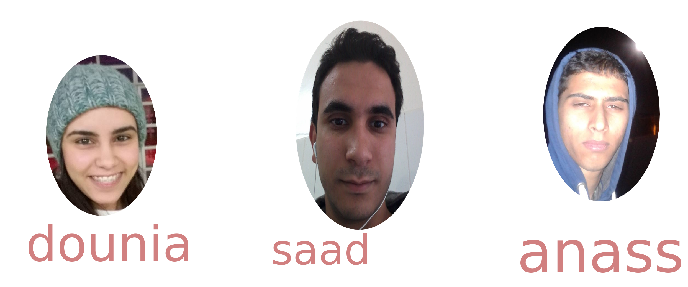
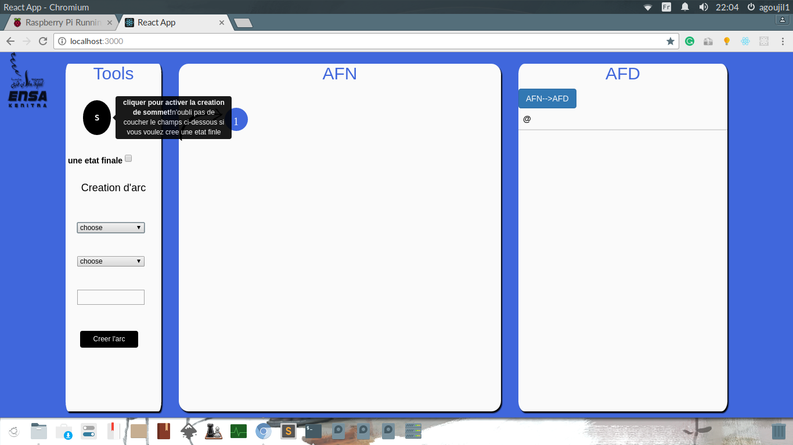
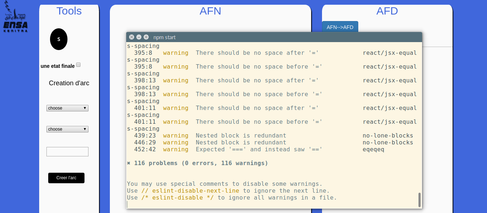
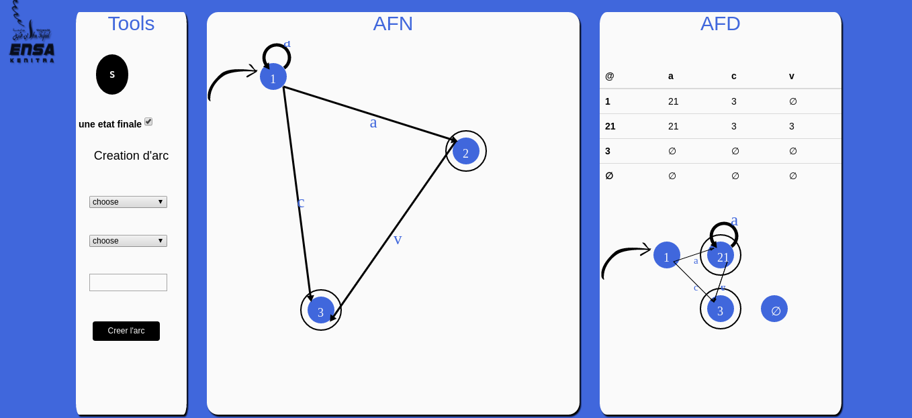

# AFN2AFD
-	-	-
[TOC]

###Introduction#
 Cet application  vient d'illustrer le fonctionnement d'un algorithme qui a pour but la déterminisation d'un automate finie. Ce programme est orienté web et écrit à l'aide de
* reactjs [https://facebook.github.io/react/](http://)
* react flux [https://facebook.github.io/flux/](http://)
* react-konva [https://github.com/lavrton/react-konva](http://)
* react-bootstrap [https://react-bootstrap.github.io/](http://)

###Comment lancer le test de l'application#
Avant il faut charger les modules de **nodejs** necessaire pour le bon fonctionnement de l'application par la commande :
```
npm install

```
et puis on lance le test de l'application par:
```
npm start

```
###auteurs#

###quelque image qui illustre le fonctionnement de l'application
<table>
<tr>
<td></td>
<td></td>

</tr>
<tr>
<td></td>
<td></td>
</tr>


</table>
